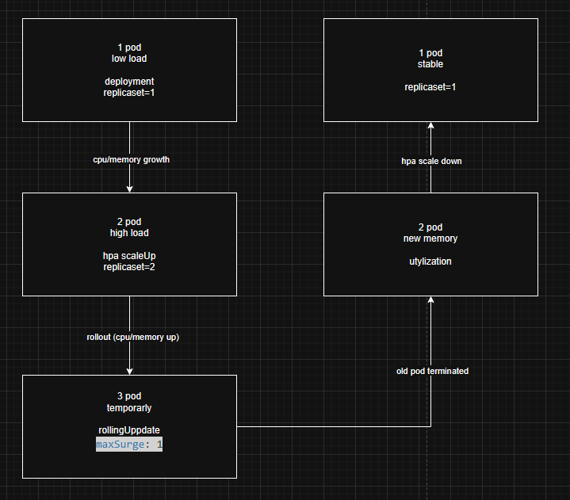
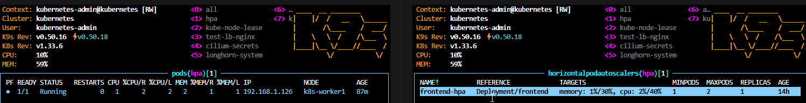

# Test: HPA + RollingUpdate bez downtime

- Deployment manages Pod versions
- HPA modifies the `spec.replicas` of Deployment
- ReplicaSet performs the actual creation/deletion of Pods


## Deployment (RollingUpdate + readiness)

```yaml
apiVersion: apps/v1
kind: Deployment
metadata:
  name: frontend
  namespace: hpa
spec:
  replicas: 1
  strategy:
    type: RollingUpdate
    rollingUpdate:
      maxUnavailable: 0   # gwarancja braku downtime
      maxSurge: 1
  selector:
    matchLabels:
      app: frontend
  template:
    metadata:
      labels:
        app: frontend
    spec:
      containers:
      - name: frontend
        image: nginx:1.24
        ports:
        - containerPort: 80
        resources:
          requests:
            memory: "1500Mi"  
            cpu: "1500m"
          limits:
            memory: "1500Mi"
            cpu: "1500m"
        readinessProbe:
          tcpSocket:
            port: 80
          initialDelaySeconds: 5
          periodSeconds: 5
```


- `maxUnavailable: 0` - there are never 0 ready Pods
- `requests.memory` - reference point for HPA
- `readinessProbe` - Service does not route traffic to an unready Pod

---

## HorizontalPodAutoscaler (RAM + CPU)

```yaml
apiVersion: autoscaling/v2
kind: HorizontalPodAutoscaler
metadata:
  name: frontend-hpa
  namespace: hpa
spec:
  scaleTargetRef:
    apiVersion: apps/v1
    kind: Deployment
    name: frontend
  minReplicas: 1
  maxReplicas: 2
  metrics:
  - type: Resource
    resource:
      name: memory
      target:
        type: Utilization
        averageUtilization: 50
  - type: Resource
    resource:
      name: cpu
      target:
        type: Utilization
        averageUtilization: 60
  behavior:
    scaleUp:
      stabilizationWindowSeconds: 0
    scaleDown:
      stabilizationWindowSeconds: 300
```

- RAM scaling calculated relative to `requests.memory` in deployment
- `scaleDown` delayed - no flapping

---

## Service

```yaml
apiVersion: v1
kind: Service
metadata:
  name: frontend-svc
  namespace: hpa
spec:
  selector:
    app: frontend
  ports:
  - port: 80
    targetPort: 80
```

---

## Diagram stanów aplikacji



---

## Co realizuje który element

| Element | Role |
|------|-----|
| Deployment | Pod versioning, rollout |
| ReplicaSet | Maintaining the number of Pods |
| HPA | Changing `replicas` |
| readinessProbe | Protection against traffic to unprepared Pods |
| Service | Traffic routing |

---

## Manual test

1. Start:
```yaml
kubectl get pods -n hpa
```

2. Generate the load CPU:
```yaml
kubectl exec -n hpa frontend-7fbf5fbcfb-tw5vc -- \
  sh -c "timeout 60s sh -c 'while :; do :; done'"
```

3. Check: 
```yaml
kubectl get hpa -n hpa -w
```
use k9s 


4. Zmień memory w Deployment:
```yaml
requests:
  memory: "250Mi
```

5. Sprawdź brak downtime: (k9s)
```yaml
kubectl rollout status deployment frontend -n hpa

kubectl rollout history deployment frontend -n hpa
```

## Conclusions
- HPA and RollingUpdate **do not compete**, they cooperate
- Rollout changes the shape of Pods (resource/image/...)
- HPA changes their number
- `readinessProbe + maxUnavailable=0` = zero downtime
---

## Literature
1. Kubernetes Documentation – Horizontal Pod Autoscaler
2. Kubernetes Documentation – Deployments
3. Kubernetes Patterns – Autoscaling
4. CNCF Blog – Zero Downtime Deployments
5. Kubernetes API Reference (autoscaling/v2)


## Scenarios
- Many environments (namespaces) generate load.
- HPA increases the number of Pods.
- The scheduler is unable to place Pods on existing nodes.
- Pods enter the Pending (Unschedulable) state.
- Karpenter detects Pending Pods.
- It provisions new nodes.


